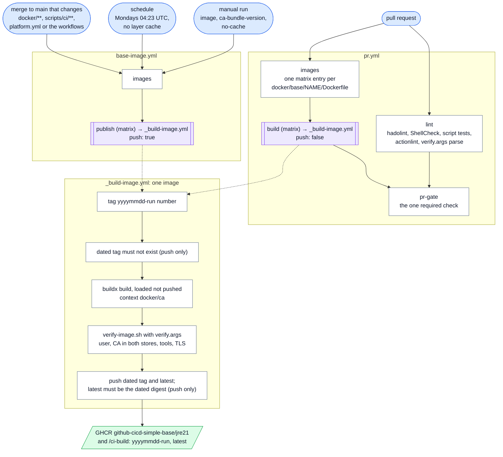

# Documentation of github-cicd-simple-base

This repository is the **base-image repository** of the Deephaven data platform: it builds and publishes the
company base images that every Java 21 app image and every CI build job start from. The platform's design
documents D0–D12 and its decision log DL-01 … DL-47 live in
[github-demo/docs](https://github.com/crazymatthsu/github-demo/tree/main/docs); the ones this repository
implements are D3 (`docs/03-docker-images.md`: image layering, the CA in both trust stores, rotation, the
`ci-build` image), D10 §5 (how a build job runs in `ci-build`) and the ADRs DL-13, DL-28 and DL-47 (this
repository). This directory holds only what is specific to this repository.

| Document | What |
|---|---|
| [`adr/`](adr/README.md) | decisions of this repository (B-0001: the extraction) |
| [`toolchains.md`](toolchains.md) | adding a toolchain to `ci-build`, adding an image |
| [`../docker/ca/README.md`](../docker/ca/README.md) | the CA bundle, its rotation, the enterprise source |

## The layout against the contract (D12 §6.1, §6.6; DL-47)

| Contract | Here |
|---|---|
| `platform.yml` | platform `v1`, kind `base`, registry `ghcr.io/crazymatthsu`, project `github-cicd-simple-base` |
| images `<registry>/<project>/<name>` from `docker/base/<name>/Dockerfile` | `jre21`, `ci-build` |
| each image declares its outside checks | `docker/base/<name>/verify.args` → `scripts/ci/verify-image.sh` |
| the CA bundle is the build context | `docker/ca/` (demo: the public `demo-root-ca.pem`) |
| `docs/`, `.github/CODEOWNERS` | present |
| `uses: <org>/platform-ci/...@v1` | **not yet** — vendored copies of `registry-login`, `resolve-image.sh`, `verify-image.sh` (README) |

## Pipeline

- `pr.yml` on a plain branch push runs lint only and reports `push-gate`, which never satisfies the required
  `pr-gate`. On a pull request it builds and verifies every image exactly as `base-image.yml` will, so a
  Dockerfile, toolchain, CA or `verify.args` mistake is found before merge.
- `base-image.yml` publishes from `main` only. The dated tag is immutable: re-running a run whose tag was
  pushed fails on purpose; start a new run. `latest` moves only after the dated tag was pushed and resolves to
  the same digest.
- The weekly run builds without the layer cache: OS, JDK and tool patches arrive through a rebuild, and a
  cached `apt-get install` layer would republish last month's packages.
- Nothing writes to `main`: no job holds `contents: write`, there is no release line and no version file;
  the images are versioned by their dated tags alone.

## First run

The first `base-image.yml` run (the merge of the pull request that created this tree, or a manual run)
creates the GHCR packages `github-cicd-simple-base/jre21` and `github-cicd-simple-base/ci-build`, linked to
this repository. The packages start **private**: make them public, or grant `packages: read` to every
repository that pulls them (package settings → Manage Actions access) — a consumer's `FROM` or `container:`
fails to pull otherwise.

## Repository settings (D12 §6.10)

No file can set these; apply them once in the repository settings:

1. **Ruleset on `main`**: pull request required, **one approval**, required check `pr-gate`, linear history,
   block force pushes and deletion, no bypass. Nothing in the pipeline needs to write to `main`.
2. **Packages**: visibility of `github-cicd-simple-base/jre21` and `github-cicd-simple-base/ci-build` (above).
3. **Optional**: the Renovate app (`renovate.json` bumps the toolchain pins, the Temurin images and the
   actions); a repository variable is not needed by anything.

## Consumers

| Consumer | Uses | Moves with |
|---|---|---|
| `github-cicd-simple-apps` (and every Java 21 app repository) | `FROM …/jre21:<tag>` in each app Dockerfile; `…/ci-build` as the `container:` of its build job and its it-runner service; `scripts/ci/resolve-image.sh` to pin `latest` once per run | a Renovate bump of the dated tag; `BASE_IMAGE` / `CI_BUILD_IMAGE` for a one-off |
| the demo monorepo `github-demo` | still builds its own copies `ghcr.io/crazymatthsu/base/*` until it consumes these (DL-47) | — |
